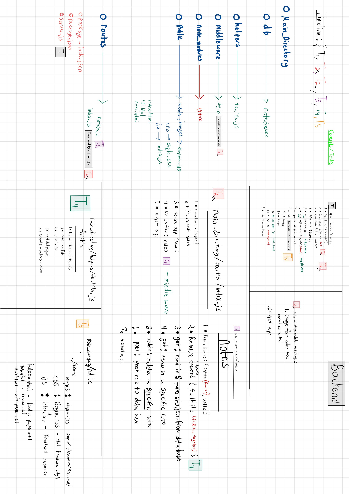

# Note Taker Starter Code

## Purpose

The primary purpose of this project was for me to learn how routes work with the back end. What I decided to do was spend time understanding student mini project 28 within the express week to recreate the backend and utilize the front-end code that already existed within this challenge. This diagram shows my thought process:

### Diagram
 

### Deployment

#### Heroku
https://gato365-miniature-eureka-eman.herokuapp.com/

#### GitHub
https://gato365.github.io/gato365-miniature-eureka/